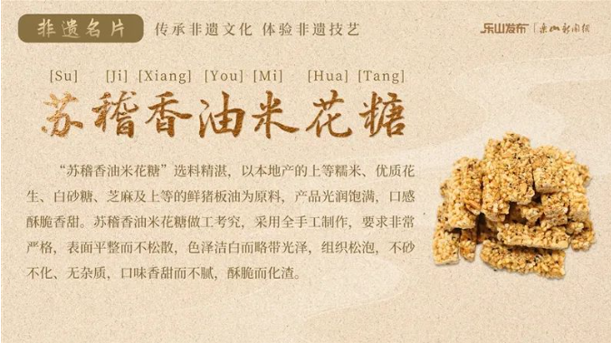

# 民俗文化 APP UI 设计规范与美化指南

版本：2025.10.27  
适用范围：移动端 iOS / Android

---

## 1. 核心设计理念
- **简洁易用**：所有页面遵循“懂民俗、易上手”的体验目标，控制信息层级不超过 3 级。
- **暖调沉浸**：通过米棕色调营造温润质感，图片与插画突出地域文化。
- **一致性优先**：导航、组件、间距、圆角等采用统一规格，便于快速搭建与扩展。
- **内容为主**：界面元素服务内容展示，避免装饰性信息干扰核心操作。

---

## 2. 品牌与色彩系统

| 名称 | 色值 | 用途与规范 |
| --- | --- | --- |
| 基础背景色 Base | `#D9C7AA` | 页面背景、模块底色，占主色面积 70% 以上。 |
| 边框与容器底色 Frame | `#BAA789` | 卡片内层背景、分隔线、弱层级容器。建议以 1px 边框或轻度底色块形式出现。 |
| 主色 / 强调色 Accent | `#5B2C18` | 关键按钮、选中态、强调信息。**禁止大面积铺底**，单页面积≤15%。 |
| 对比文字色 Contrast | `#FFFCF9` | 仅在 `#5B2C18` 背景上的文字/图标使用，保证对比度 ≥ 4.5:1。 |
| 标准文本色 Primary Text | `#5B2C18` | 标题、正文在浅色背景上的默认文字颜色。可通过不透明度控制层级（100%/80%/60%）。 |
| 辅助文本色 Secondary Text | `#4B2415`（Accent 80%） | 用于标签、说明文字、时间信息等次要内容。 |

> 色彩使用建议：  
> - 页内至少保留 50% 的 Base 背景裸露，避免眩目。  
> - 高频交互区域（底部导航、操作栏）优先使用 Base + Frame 组合，通过 Accent 描绘焦点。  
> - Banner、插画可使用更丰富的民俗色，但需保持与 Base 的暖调相容。

---

## 3. 字体与排版
- **字体**：系统默认字体（iOS：PingFang SC / Android：Source Han Sans）。  
- **字号层级**：
  - H1 主视觉标题 26px / Bold / 行高 32；
  - H2 模块标题 20px / Medium / 行高 28；
  - H3 卡片标题 16px / Medium / 行高 24；
  - Body 正文 14px / Regular / 行高 22；
  - Caption 标签 12px / Regular / 行高 18。
- **行距与段落**：段前段后 8px，段内行距 ≥ 1.6 倍。
- **字重控制**：整页最多两种字重（Regular、Medium/Bold），主按钮文字使用 Medium。
- **对齐**：左对齐为主；居中仅用于 Banner 口号或数字化信息。

---

## 4. 栅格与间距
- 页面左右安全间距 16px；栅格宽度 2 列卡片时单列 50%-8px 间隙。
- 模块间垂直间距 24px，组件内元素间距 12px。
- 卡片圆角 16px；按钮圆角 12px；图标容器 12px。
- 阴影统一使用：Y=4、模糊=16、扩散=0、颜色 `rgba(91,44,24,0.12)`。

---

## 5. 全局导航与通用结构

### 5.1 底部标签栏（Bottom Tab Bar）
- 标签：`首页` / `探索` / `专题` / `我的`。
- 样式：背景 `#D9C7AA`，分隔顶线 `#BAA789` 1px。
- 图标：线性图标 + 文字，未选中状态 `#4B2415` 60% 不透明，选中状态文字与图标填充 `#5B2C18`。

### 5.2 通用页面头部
- 主页面：问候语（例如“晚上好！”）+ 搜索栏 or 快捷入口。
- 子页面：左侧 24px 返回箭头（向左折线），中间标题，右侧可放过滤/更多操作。
- 状态栏背景与页面一致，避免色块切换。

---

## 6. 页面模板

### 6.1 首页（Home）
> 首页强调“先内容后功能”，各模块保持 24px 垂直间距与 16px 横向安全边距，整体以 Base 背景衬托内容。

1. **问候区**（56px 高）
   - 布局：左侧主问候语（H2 字号 20px / Medium），右侧垂直堆叠次要提醒（天气、更新提示），上下各保留 8px 呼吸空间。
   - 交互：点击提醒进入对应功能（天气详情、系统公告），点击区域高度≥44px。
   - 视觉：背景保持 Base 纯色，可叠加透明几何纹理。建议在右上角嵌入小插画强化温度感，裁剪 `Photo/photo13.png` 的上半部分为 40px 圆角矩形。
   - 参考图：

2. **搜索栏**（44px 高 / 圆角 22px）
   - 布局：左起 16px 留白 → 放大镜图标（18px，描边 `#5B2C18` 80%）→ 12px 间距 → 搜索提示文字。右侧可插入语音按钮或扫码入口（24px 圆形按钮）。
   - 样式：底色使用 `#BAA789` 30% 不透明叠加 Base；边框 1px `#BAA789` 60%。提示文字采用 Secondary Text 60% 不透明。
   - 视觉素材：可在搜索栏右端覆盖轻质纹理，使用 `Photo/photo08.png` 的中央纹理进行 16px 高度裁剪，降低不透明至 20%，避免干扰输入。

3. **主 Banner**（全宽 16:9）
   - 布局：背景左侧预留 40% 宽的文字区（底部对齐主标题、简短描述、Outline 按钮），右侧放置插画或活动摄影，保持 32px 内边距。
   - 主标题：H1 26px / Bold；副标题最多两行；按钮使用 Secondary 样式（1px 描边，圆角 12px），常态背景透明。
   - 行为：Banner 点击跳转专题详情，按钮跳转报名或购票页。
   - 背景素材：优先使用横向照片，推荐 `Photo/photo15.png`（675x379，接近 16:9），文字区可叠加左侧渐变 (`rgba(91,44,24,0.65)` → 透明) 提升可读性。
   - 参考图：

4. **推荐展览模块**（H2 标题 + “更多”）
   - 标题：左侧 H2 20px / Medium；右侧“更多”按钮采用文字 + Arrow Right 图标（16px），整体点击区域 44x44px，标题行底部分隔线 1px `#BAA789` 40%。
   - 栅格：下方两列卡片（宽度 = (屏宽 - 16*2 - 12)/2），卡片顶部图 4:3，图下 12px 内边距文本区包含 H3 标题 + 日期/地点 + 次要操作。
   - 内容建议：优先展示线下常设展 + 当期限时展的组合，按热度排序，并保留 1 张空状态提示位。
   - 图片选用：使用 `Photo/photo01.png` 与 `Photo/photo02.png` 作为示例展览图，裁剪为 4:3 并应用 16px 圆角；保持边框 `#BAA789` 1px。
   - 参考图：  
       
     

5. **其他模块**（卡片或横向滑动）
   - 热门手作：延续双列卡片，突出手作成品 / 教程，按钮使用 Ghost 样式。图片建议取 `Photo/photo05.png`，可裁剪为 1:1 以适配卡片顶部。
   - 本周活动：采用横向滑动列表（卡片宽 240px，高 180px），标题 + 日期 + 标签。使用 `Photo/photo07.png`（竖幅）裁剪中部为 16:9 作为封面。
   - 社区精选/视频：可替换为 3 卡横滚样式，顶部标题与“更多”按钮同推荐展览标准。
   - 空状态：保持 Base 底色 + 插画占位（可复用 `Photo/photo03.png` 的中央元素，降低不透明度至 30%）。
   - 参考图：  
       
     

### 6.2 探索页（Explore）
- 顶部搜索栏与筛选按钮并排。
- 分类标签使用可横向滚动的胶囊标签（高度 32px，底色 `#BAA789` 40%）。
- 内容区域支持横向滑动专题列表 + 主题聚合卡片。

### 6.3 专题页（Topic）
- 顶部：返回箭头 + 标题“专题”。
- 标题下方：横向可切换标签（推荐 / 民间文学 / 传统戏剧 / …），选中底线 `#5B2C18` 2px。
- 主区域：滚动 Banner、专题介绍卡、项目展示卡（两列布局）。
- 活动介绍段落采用图文卡（左图右文）或时间轴形式。

### 6.4 我的页（Profile）
- 顶部用户信息卡（头像 + 昵称 + 会员状态）。
- 快捷入口：订单、收藏、优惠券等以 4 列网格展示。
- 底部展示最近浏览/收藏的展览卡片。

### 6.5 购物车页（Cart）
- 列表项：左 96px 图片，右侧信息区等宽排列，包含标题、属性、价格、数量步进器。
- 商品行之间使用 `#BAA789` 1px 分隔线，底色 `#D9C7AA`。
- 底部固定结算栏（见第 8 节）。

---

## 7. 核心组件规范

### 7.1 搜索栏
- 高度 44px，圆角 22px，背景 `#BAA789` 30% 不透明。
- 左对齐放大镜图标（18px），右侧可选语音/扫码图标。
- 提示文字使用 Secondary Text（60% 不透明）。

### 7.2 Banner 模块
- 主 Banner：全宽 16:9；背景可使用渐变或插画；文字区留白 ≥ 32px。
- 次级横向 Banner：高度 120px，圆角 16px，可横滑。

### 7.3 标签（Chips / Tabs）
- Tabs：高度 36px，未选中底色透明，文字 `#4B2415` 80%；选中底部 2px `#5B2C18` 下划线。
- Chips：高度 32px，圆角 16px，底色 `#BAA789` 50%，选中态填充 `#5B2C18`、文字 `#FFFCF9`。

### 7.4 卡片（Content Card）
- 布局：网格 2 列，每卡宽度 = (屏宽 - 16px*2 - 12px)/2。
- 结构：顶部 4:3 比例图，图下方 12px 内边距文本区。
- 内容：标题（最多两行截断），辅助信息（日期/地点）、操作按钮或收藏图标。
- 背景：默认 `#FFFCF9`（可在 Base 上凸显）；边框 `#BAA789` 1px。
- 阴影：同通用规范，Hover/按压时可提高不透明度至 0.2。

### 7.5 列表条目
- 左图右文：图片 72-96px，文字区左对齐。文字区内标题 + 描述 + 价格行。
- 分隔：行距 12px，底部 1px 分隔线（`#BAA789` 60%）。

---

## 8. 购物与操作栏

### 8.1 商品信息
- 名称使用 H3，价格使用 16px / Medium / `#5B2C18`。
- 数量控制器：减号/加号按钮 28px 正方形，边框 `#BAA789`，文字 `#4B2415`。

### 8.2 结算栏（固定）
- 背景 `#D9C7AA`，顶部描边 `#BAA789`。
- 左侧显示“总计：¥金额”，金额使用 20px/Medium。
- 右侧主按钮宽度≥屏宽 40%，高度 48px，圆角 12px，背景 `#5B2C18`，文字 `#FFFCF9`。
- 提供次要信息（优惠说明）放在按钮上方或左侧。

### 8.3 按钮体系
- Primary：背景 `#5B2C18`，文字 `#FFFCF9`，按压态背景 90% 亮度，禁用态背景 `#BAA789`。
- Secondary：边框 `#5B2C18` 1px，背景透明或 `#D9C7AA` 80%，文字 `#5B2C18`。
- Ghost：文字 `#5B2C18`，无边框。用于卡片操作或页内次要动作。

---

## 9. 图标、插画与图片
- 图标风格：线性/简线结合轻微圆角，与字体笔画一致。尺寸 24px，间距 24px。
- 插画/摄影：优先采用暖调、木质、手作相关素材。使用原图链接：  
  - 参考 1：`https://www.zcool.com.cn/work/ZNjU2Nzc3Njg=.html`  
  - 参考 2：`https://www.zcool.com.cn/collection/ZNTA4MzgzMg==?`
- 图片需保持统一圆角（卡片图 16px，列表图 12px），并在 Base 背景上加 1px Frame 边框。

---

## 10. 交互状态与动效
- **按钮**：按压时缩放 0.96，过渡 150ms；禁用态降低不透明度至 40%。
- **导航切换**：底部标签切换使用 200ms 淡入淡出 + 位移，保持手感柔和。
- **卡片 Hover/按压**：移动端使用轻微阴影增强与缩放 0.98，时长 120ms。
- **横向滑动**：Banner、标签切换提供指示点或滑动阴影提示。

---

## 11. 可访问性与可读性
- 对比度：所有文字对比度 ≥ 4.5:1；小字号（12px）确保 ≥ 7:1。
- 点击区域：主要操作最小高度 44px、宽度 44px。
- 动效节奏：避免眩光或闪烁；在系统“减少动态效果”时提供静态反馈。
- 文本截断：多语言考虑，标题使用 2 行截断 + 省略号。

---

## 12. 参考样式（示意图）
- 主页布局、高保真示例、分类页、购物车界面等参考截图已保存在 `UI设计指导.assets`。请按照本规范验证色彩、间距与组件形态的一致性。
- 示例文件：
  - `UI设计指导.assets/image-20251027113411203.png`
  - `UI设计指导.assets/image-20251027113439843.png`
  - `UI设计指导.assets/image-20251027124008145.png`
  - `UI设计指导.assets/image-20251027114016479.png`
  - `UI设计指导.assets/image-20251027123613399.png`
  - `UI设计指导.assets/image-20251027124235019.png`
  - `UI设计指导.assets/image-20251027124243550.png`
  - `UI设计指导.assets/image-20251027124253997.png`
  - `UI设计指导.assets/image-20251027124309283.png`

---

## 13. 交付与验收建议
- 设计稿输出时附带色彩标注、组件名称与间距标示。
- 开发联调时使用组件库 Token（颜色、圆角、间距）统一管理，避免硬编码。
- 在上线前针对首页、专题页、购物车进行 A/B 可用性走查，确认交互流畅与视觉一致。
